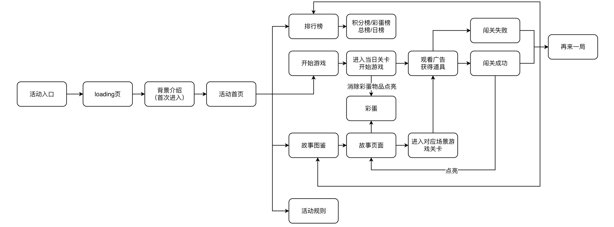
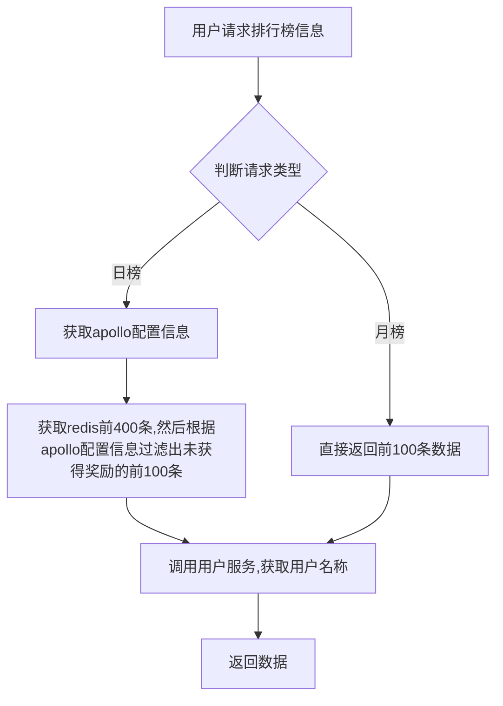

# 十周年活动
## 活动背景
1. 进入游戏： 
    - 首次进入游戏展示游戏的背景故事，随后进入游戏首页 
    - 非首次进入游戏直接进入游戏首页，点击「开始游戏」，直接进入游戏
2. 开始游戏：
    - 进入当日场景
    - 类似羊了个羊的三消游戏，在物品堆中点击物品即可加入放置栏，放置栏中每三个相同物品即可消除
    - **彩蛋：以一定概率出现彩蛋物品，消除可以获得彩蛋**
    - 在消除过程中可使用道具降低游戏难度，可以通过观看广告获得道具
    - 游戏进度50%即可解锁图鉴；游戏进度50%时所获积分翻倍；游戏进度70%是所获积分再次翻倍
3. 游戏结束：
    - 闯关成功：消除全部物品
    - 闯关失败：放置栏物品放满或者时间到，直接进入结算
    - 彩蛋结算：且点亮消除物品的对应彩蛋
    - 根据积分和彩蛋数量排行
4. 道具：转发观看广告游戏可以获得游戏道具
    - 移出:移出三张牌并把他们堆放到旁边
    - 撤回:撤回最近的一张牌并把他放回到原位置 
    - 洗牌:随机打乱未使用的所有牌


## 服务器设计
### 游戏功能
1. 开始游戏
   1. 用户点击开始游戏，传入图签id（对应关卡）
   2. apollo中获得黑名单信息进行校验
   3. 判断用户当前图签id是否已经解锁
   4. 获取用户当前图签id对应的游戏局数
   5. 根据游戏局数组装地图数据去apollo获取对应的地图数据，[levelData:[ID,坐标(x,y),layer,type],TypeData:{id,数量}]，然后随机化后根据图片类型id给每个levelData赋值。
   6. 从配置中加载彩蛋信息
   7. 根据地图卡片信息获得彩蛋数量，总地图卡片的十分之一向下取整，然后至少一个，循环10%（概率为特殊彩蛋，选中后彩蛋数量减一，其他彩蛋100%为普通彩蛋），（90%概率为普通彩蛋，随机选择一个普通彩蛋，然后随机选择不超过剩余彩蛋数量选择为此彩蛋），直到彩蛋数量为0.
   8. 对于第十局保底，固定三个彩蛋，一个特殊彩蛋和两个未获得彩蛋。如果对局数大于10，且60分钟内开局40次以上且获得彩蛋数大于30，任务刷彩蛋，不出彩蛋。
   9. 往数据库插入mid，图签id，彩蛋数据，更新redis对局数，生成游戏id
   10. 获取用户剩余道具数目，获取用户信息并返回
2. 完成游戏
   1. apollo中获得黑名单信息进行校验
   2. 校验分数和时长是否合理 
   3. 更新对局信息，更新用户彩蛋信息，更新对局详情
   4. 更新四个排行榜，（分数日榜总榜，彩蛋日榜总榜）
3. 查看图签
   1. 根据mid获取用户获取图签信息。
   2. 根据mid获取用户获取彩蛋信息。
4. 用户抽奖
   1. 黑名单检查
   2. 抽取奖品
   3. 将奖品信息插入数据库，然后写入redis来进行轮播展示
### 排行榜
1. 需求：客户端传入 `mid` 和 `rank_type`，返回排行榜信息前100条信息和用户排名信息，日榜不能显示已经获得奖励用户。
2. 设计：
- 基于redis的zset结构实现排行榜，总榜的 `key=tenth_anniversary_all`,日榜的 `key=tenth_anniversary_day_(当天日期)`。
- 对于日榜因为只显示100条没有获得奖励的用户，在redis中拉取400条数据，然后基于Apollo的配置 `key=tenth_anniversary_obtained_mids` 获得已经获得奖励的用户名单，然后遍历同时过滤mid构建出前100条的排名。
- 对于总榜直接获取前100条返回即可。
- 根据返回的榜单mid调用用户服务获取用户信息组装用户名称返回。
- 若此用户未在榜单排名返回-1，端上显示未上榜。
3. 图示：

## 数据库设计
dbTenThAnniversary= "tenth_anniversary" //数据库名称
1. colTenThAnniversaryGame="game"//游戏表
```
type TenthAnniversaryGameSt struct {
	Id        primitive.ObjectID `json:"id" bson:"_id,omitempty"`      
	Mid       int64              `json:"mid" bson:"mid"`               //用户mid
	PictureId int64              `json:"picture_id" bson:"picture_id"` // 图鉴id，1-10
	Score     int64              `json:"score" bson:"score"`           // 当前对局获得的分数
	EggData   map[int]int        `json:"egg_data" bson:"egg_data"`     //彩蛋信息
	IsSuccess bool               `json:"is_success" bson:"is_success"` //是否成功
	St        int64              `json:"st" bson:"st"`                 //开始时间
	Et        int64              `json:"et" bson:"et"`                 //结束时间
	Ct        int64              `json:"ct" bson:"ct"`                 //创建时间
	Ut        int64              `json:"ut" bson:"ut"`                 //更细时间
}
```
2. colTenThAnniversaryPicture="picture"//图签表
```
type TenthAnniversaryPictureSt struct {  
	Id        primitive.ObjectID `json:"id" bson:"_id,omitempty"`       //主键
	Mid       int64              `json:"mid" bson:"mid"`                //mid
	PictureId int64              `json:"picture_id" bson:"picture_id"` // 图鉴id
	GameId    string             `json:"game_id" bson:"game_id"`       // 解锁该图鉴的时候对应的对局
	Ct        int64              `json:"ct" bson:"ct"`                  
	Ut        int64              `json:"ut" bson:"ut"`
}
```
3. colTenThAnniversaryEgg= "egg"//用户彩蛋表
```
type TenthAnniversaryEggSt struct {
	Id        primitive.ObjectID `json:"id" bson:"_id,omitempty"`
	Mid       int64              `json:"mid" bson:"mid"`//mid
	PictureId int64              `json:"picture_id" bson:"picture_id"`//图签id
	EggId     int64              `json:"egg_id" bson:"egg_id"`//彩蛋id
	Count     int64              `json:"count" bson:"count"`//此彩蛋对应数量
	Ct        int64              `json:"ct" bson:"ct"`
	Ut        int64              `json:"ut" bson:"ut"`
}
```
4. colTenThAnniversaryEggDetail= "egg_detail"//用户彩蛋表，基于gameId的临时中间表
```
type TenthAnniversaryEggDetailSt struct {
	Id     primitive.ObjectID `json:"id" bson:"_id,omitempty"`
	Mid    int64              `json:"mid" bson:"mid"`
	GameId string             `json:"game_id" bson:"game_id"`
	EggId  int64              `json:"egg_id" bson:"egg_id"`
	Count  int64              `json:"count" bson:"count"`
	Ct     int64              `json:"ct" bson:"ct"`
	Ut     int64              `json:"ut" bson:"ut"`
}
```
5. colTenThAnniversaryReward= "reward"//用户中奖记录表
```
type TenthAnniversaryRewardSt struct {
	Id       primitive.ObjectID `json:"id" bson:"_id,omitempty"`
	Mid      int64              `json:"mid" bson:"mid"`
	RewardId string             `json:"reward_id" bson:"reward_id"` //奖品id
	GameId   string             `json:"game_id" bson:"game_id"`     //游戏id
	Ct       int64              `json:"ct" bson:"ct"`
	Ut       int64              `json:"ut" bson:"ut"`
}
```
6. colTenThAnniversaryPopUser        = "pop_user"//去重用表，记录弹窗过的用户信息
```
type TenthAnniversaryUserPopSt struct {
	Id  primitive.ObjectID `json:"id" bson:"_id,omitempty"`
	Mid int64              `json:"mid" bson:"mid"`
	Ct  int64              `json:"ct" bson:"ct"`
}
```
7. colTenThAnniversaryProp= "prop"//用户道具表
```
type TenthAnniversaryPropSt struct {
	Id     primitive.ObjectID `json:"id" bson:"_id,omitempty"`
	Mid    int64              `json:"mid" bson:"mid"`
	PropId int64              `json:"prop_id" bson:"prop_id"` //移出道具1、撤回道具2、打乱道具3
	Count  int64              `json:"count" bson:"count"`     // 剩余次数
	Ct     int64              `json:"ct" bson:"ct"`
	Ut     int64              `json:"ut" bson:"ut"`
}
```
8.colTenThAnniversaryNewUserProcess = "new_user_process"//发奖去重表
```
type TenthAnniversaryNewUserProcessSt struct {
	Id       primitive.ObjectID `json:"id" bson:"_id,omitempty"`
	Mid      int64              `json:"mid" bson:"mid"`
	UserType int64              `json:"user_type" bson:"user_type"`
	Ct       int64              `json:"ct" bson:"ct"`
}
```